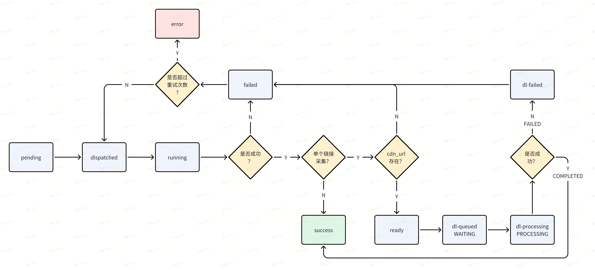

# 单个链接采集任务

`单个链接采集`（Single URL Capture）是 TaskAgent 中专门面向“单条视频链接快速处理”场景的任务类型。与传统依赖物理设备的采集不同，这类任务不会分配到设备池，而是由 `SingleURLWorker` 直接调用 `content_web_crawler` 的下载服务（`POST /download/tasks` + `GET /download/tasks/<task_id>`）完成采集。

## 任务字段要求

任务表需要提供以下字段（字段名可通过 `TASK_FIELD_*` 环境变量覆盖）：

| 字段 | 说明 |
| --- | --- |
| `Scene` | 固定为 `单个链接采集`，调度器据此识别任务类型。|
| `BookID` | 短剧/Book 编号，作为业务主键之一。|
| `UserID` | 统筹维权账号，用来构建 GroupID。|
| `URL` | 视频/链接地址，后续调用 API 时直接使用。|
| `Params` | 备用 JSON 字段，可携带额外上下文。|
| `Logs` | 文本字段，用于存储单链任务的内部日志（JSON），包括 task_id/vid/错误信息等。|

`SingleURLWorker` 会校验以上字段：缺少 `BookID`/`UserID`/`URL` 任意一项时，任务会先被标记为 `dl-failed` 并写入失败原因，随后回退为 `failed` 进入设备侧重试；最终是否进入 `error` 由 `RetryCount` 决定。

## Cookies 管理

目前 SingleURLWorker 不再从 Feishu 读取/转发 cookies，调用下载服务时不会携带 cookies。

## 调度与状态流转

以下流程图对应「设备侧 + 下载侧」组合链路（fox 场景）：

1. 设备侧（`DevicePoolAgent`）负责 `pending → dispatched → running` 的执行与回写：
   - `running` 失败直接标记 `failed`；
   - 若为单链采集，设备侧会等待 `cdn_url` 写入：
     - `cdn_url` 缺失则标记 `failed`；
     - `cdn_url` 存在则标记 `ready` 并写入 `Extra.cdn_url`。
2. 下载侧（`SingleURLWorker`）建议使用 ready 模式（`singleurl.NewSingleURLReadyWorkerFromEnv...`），批量拉取 `ready` 任务并入队下载服务：
   - 为了加速 `ready → dl-queued` 的入队吞吐，可以通过 `SINGLE_URL_CONCURRENCY`（或 `cmd singleurl --concurrency`）并发调用下载服务的 `POST /download/tasks`；但对 Feishu 的状态写回仍保持串行以避免触发频率限制。
   - Worker 启动后会先立即执行一轮 `ProcessOnce`，避免等待一个完整的 poll interval 才开始处理任务。
3. 对于 `ready` 且字段完整的任务：
   - Worker 会调用下载服务 `POST /download/tasks`，请求体包含 `{platform,bid,uid,url}`（可选 `cdn_url`）；
   - 成功后会把任务 `Status` 更新为 `dl-queued`，将 `GroupID` 写成 `BookID_UserID`，并把下载服务返回的 `task_id` 写入 `Logs`（JSON 数组；兼容旧版单对象格式）；
   - `DispatchedAt/StartAt` 同步为当前时间，用于后续统计；若创建失败则标记 `dl-failed` 并写入错误信息（随后回退为 `failed`）。
4. `SingleURLWorker` 继续在每轮 `ProcessOnce` 中拉取 `Status ∈ {dl-queued,dl-processing}` 的任务并轮询 `GET /download/tasks/<task_id>`：
   - 为避免跨天任务（例如任务 `Date=2025-12-27`，但在 `2025-12-28` 仍处于 `dl-queued/dl-processing`）因 `Date` 过滤导致永远拉不到，**active 状态轮询不会附加 Date 条件**；
   - active 状态轮询按 `dl-processing → dl-queued` 顺序拉取，本轮配额优先用于 `dl-processing`，其余再分配给 `dl-queued`；
   - 为避免任务量过大时始终只轮询前 `fetch-limit` 条导致“后续页任务永远不更新”，active 状态轮询每轮至少翻 `3` 页，单页默认 `100` 条，并在进程内维护 `page_token` 轮转扫描；
   - 为避免 bitable URL 自带的 view 过滤/排序影响任务可见性，singleurl worker 查询任务表时会忽略 view（只依赖 filter 条件）。
   - active 状态的 Feishu 回写会尽量使用 batch_update（单次最多 500 行）以加速大规模积压场景的状态扭转。
   - `ready → dl-queued` 的入队阶段仍默认只扫描 `Today + Yesterday`，避免全表扫描带来的频率/性能风险。
   - 若某一轮 `ProcessOnce` 执行耗时超过 `poll interval`，后续 tick 可能会被跳过（日志会提示 `single url worker pass exceeded poll interval; ticks may be skipped`）。

| 下载服务状态 | Task 表 Status | 行为 |
| --- | --- | --- |
| `WAITING` | `dl-queued` | 维持排队状态，如缺失 task_id 会自动补齐/报错。 |
| `PROCESSING` | `dl-processing` | 通过 `UpdateFeishuTaskStatuses` 更新状态，保持原始时间戳。 |
| `COMPLETED` | `success` | 写入 `vid` 到 `Logs`（JSON 数组 attempt 中包含 `task_id/vid`），并把 `EndAt`/`ElapsedSeconds` 补齐。 |
| `FAILED` / 404 | `dl-failed` | 将失败原因附加到 `Logs`，同时保留 `task_id` 方便排查；随后回退为 `failed` 交给设备侧重试。 |

这样即可形成 `pending → queued → running → success/failed` 的闭环，无需人工介入。单链任务完成后的汇总推送与 `Webhook` 字段更新不再由 `SingleURLWorker` 直接触发，而是统一交给 `pkg/webhook` 中的 `WebhookResultCreator/Worker` 通过「推送结果表」驱动：

- 对于 `BizType=single_url_capture` 的记录，`WebhookResultWorker` 会在同一 GroupID（同一 `(App, BookID, UserID)` 组合）下所有任务进入终态后：
  - 基于任务表构造分组级别的 webhook payload，并推送到 `SUMMARY_WEBHOOK_URL`；
  - 若配置了 `CRAWLER_SERVICE_BASE_URL`，同时调用下载服务的 `POST /download/tasks/finish` 接口（`status/total/done/unique_combinations/unique_count/task_name/email`），其中 `task_name` 默认基于 GroupID + 时间戳生成，用于下游任务维度统计。

## foxagent 入口

`foxagent search` 在以下模式中自动携带单链任务 worker：

| 模式 | 开关 | 说明 |
| --- | --- | --- |
| Auto-pool | `foxagent search --auto-pool --single-url-poll-interval=30s` | 启动设备池时同步运行 `SingleURLWorker`，常驻轮询。|
| 单次执行 | `foxagent search`（非 auto-pool） | 拉起任务前后可手动调用 `SingleURLWorker.ProcessOnce`（如需预处理单链任务，可在业务侧调用）。|

`--fetch-tasks-limit` 同时决定了单链 worker 每轮的抓取上限。想要暂停该能力，可将任务表中 `Scene=单个链接采集` 的数量保持为 0，或显式关闭自定义 worker。

## 关联文件

- 代码：`pkg/singleurl`（核心逻辑与 HTTP 客户端）、`client.go`（Scene 优先级）、`cmd/singleurl.go`（CLI 入口）。
- 配置：`docs/ENVIRONMENT.md` 中的 `CRAWLER_SERVICE_BASE_URL`、`COOKIE_BITABLE_URL`、`TASK_FIELD_BOOKID`、`TASK_FIELD_URL` 等说明。
- 下载服务：`content_web_crawler`（`routes/download_routes.py` + `services/download_service.py`），负责处理 `/download/tasks` / `/download/tasks/<task_id>` / `/download/tasks/finish`。
